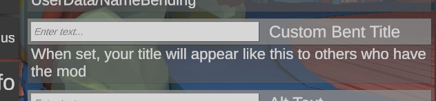

# Advanced UI Customization
## View Presentation Structure

### Entry View
Each representation of an entry in the UI is called an `EntryView`. 
In general, it is a Unity UI panel that contains labels for the `DisplayName`,and `Description`. 
It also contains a `Control` element that's used to actually interact with the data. 
This could be a TextInput, a Toggle, etc. whichever might be appropriate for the data type being represented. 

UI Framework has some built in ones that cover the most common data types and will default to TextInput for things it 
doesn't know how to handle and hope that the entry can be serialized and deserialized using TOML.

### Entry Model
Won't go into too much detail here because I haven't finalized the design for this class yet.
But this is the part of the program that actually interacts with MelonPreferences. 

An `EntryAdapter` interacts with the model to retrieve the data and present it to the user through the view
then takes the user's input and submits it back to the model which updates the MelonPreference Entry value

### EntryAdapters
This is a custom component added to the `Entry View` root panel. 

-----

## Making custom Entry Views
There's a unity package in [_Misc/TestFit.unitypackage](_Misc/TestFit.unitypackage) that contains the prefab for the 
UI Framework window. You can add it to a unity project and build your views in 

## Making custom EntryAdapters
Inherit the `DataEntryAdapter` class to create your own custom component that you will add to your view prefab's root panel. 

### Name and Description Labels
These are the game objects that should display the name and the description of the entry.
By default the `DescriptionText` and `DisplayName` properties reference a GameObjct called `"Description"` and `"Data/Label"` 
respectivey in your view prefab's hierarchy. But both properties can be overridden.
### Data Hooks
These are the methods for moving data between the model and the view.
`DisplayEntryInfo(string displayName, string description)` 
- Timing: Called when the view is being built. 
- Function: Assigns the name and the description to the values for the `DescriptionText` and `DisplayName` properties.
- Override this method if you want custom behavior or have different game objects in your view prefab that you want to use for
the name and description

`DisplayData(object boxedValue)` 
- Timing: Called right after `DisplayEntryInfo`
- Function: Takes the value from the model and passes the value as a parameter so that it can be displayed in the correct control element;
- Override this method to display the value appropriately in your custom view. 

`SubmitValue(object value)` 
- Timing: Mod-initiated.
- Function: Submits a value to the model. 
- Call this method and pass the new value parameter when the user has made an input. 
- Note: Generally this calls the UI to refresh completely. So 
`PreSaveAction()` 
- Timing: Called after the user clicks the save button, before the model data actually saves the value to the file. 
- Function: Gives you a chance to parse the user input and call SubmitValue to pass it as a parameter before the data is actually
saved to a file. 
- Note: This shouldn't be needed in most cases. You should add the appropriate listeners to your control elements
and those can pass the vaues to SubmitValue. 

## ICustomViewProvider
This is the UI extension that you pass as the entry's validator. UI Framework will look for its `EntryViewPrefab` 
property and instantiate that whenever the entry needs to be displayed to the user. 
### EntryViewPrefab. You assign your view prefab to this property assuming it already has the correct DataEntryAdapter component
added