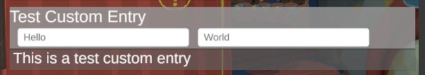

# Advanced UI Customization

## View Presentation Structure
### Entry Model
Won't go into too much detail here because I haven't finalized the design for this class yet.
But this is the part of the program that actually interacts with MelonPreferences. 
In the future, I hope to let people make their own models compatible with whatever
data backing system they need. 

### Entry View
Each representation of an entry in the UI is called an `EntryView`. 
In general, it is a Unity UI panel that contains labels for the `DisplayName`,and `Description`. 
It also contains a `Control` element that's used to actually interact with the data. 
This could be a TextInput, a Toggle, etc. whichever might be appropriate for the data type being represented. 

UI Framework has some built in ones that cover the most common data types and will default to TextInput for things it 
doesn't know how to handle and hope that the entry can be serialized and deserialized using TOML.


### Entry Adapters
This is a custom component added to the `Entry View` root panel. 

An `EntryAdapter` interacts with the model to retrieve the data and present it to the user through the view
then takes the user's input and submits it back to the model which updates the MelonPreference Entry value

-----

## Making custom Entry Views	
### Unity Package
There's a unity package in [_Misc/TestFit.unitypackage](_Misc/TestFit.unitypackage) that contains the prefab for the
UI Framework window, as well as UIFramework's default views you can use as references.

Use this in your unity project and export your new custom view as an asset bundle to be loaded by your mod. Ulvak added functions for loading asset bundles in the [Rumble Modding API](https://github.com/UlvakSkillz/RumbleModdingAPI)

### Entry View Lifecycle
UI Framework views are ephemeral. This means a new instance is used whenever the UI refreshes or loads it in and the old one is destroyed.

The view that the user sees is *an instance* of your prefab, not the prefab itself. So references to your prefab won't be the one in the UI.

Don't make references to the view instance in the UI and make sure if it subscribes to any events in your mod, that it properly unsubscribes itself in OnDestroy();

View adapters are descended from `MonoBehaviour` so standard Unity lifecycle callbacks apply
## Making custom EntryAdapters
Inherit the `DataEntryAdapter` class to create your own custom component that'll go on your View Prefab

### Name and Description Labels
These are the game objects that should display the name and the description of the entry.
By default the `DescriptionText` and `DisplayName` properties reference a GameObjct called `"Description"` and `"Data/Label"` 
respectivey in your view prefab's hierarchy. But both properties can be overridden.

### Data Hooks
These are the methods for moving data between the model and the view.
`DisplayEntryInfo(string displayName, string description)` 
- Timing: Called when the view is being built. 
- Function: Assigns the name and the description to the values for the `DescriptionText` and `DisplayName` properties.
- Override this method if you want custom behavior or have different game objects in your view prefab that you want to use for
the name and description

`DisplayData(object boxedValue)` 
- Timing: Called right after `DisplayEntryInfo`
- Function: Takes the value from the model and passes the value as a parameter so that it can be displayed in the correct control element;
- Override this method to display the value appropriately in your custom view. 

`SubmitValue(object value)` 
- Timing: Mod-initiated.
- Function: Submits a value to the model. 
- Call this method and pass the new value parameter when the user has made an input. 
- Note: Generally this calls the UI to refresh completely.

`PreSaveAction()` 
- Timing: Called after the user clicks the save button, before the model data actually saves the value to the file. 
- Function: Gives you a chance to parse the user input and call SubmitValue to pass it as a parameter before the data is actually
saved to a file. 
- Note: This shouldn't be needed in most cases. You should add the appropriate listeners to your control elements
and those can pass the vaues to SubmitValue. 

## ICustomViewProvider
This is the UI extension that you pass as the entry's validator. UI Framework will look for its `EntryViewPrefab` 
property and instantiate that whenever the entry needs to be displayed to the user. 

You assign your view prefab to this property assuming it already has the correct DataEntryAdapter component added

More details on how to use UI extensions here: [UI Extensions](API_OverView.md#ui-presentation-control-validator-extensions)


## Example code
This is an example of a custom adapter for a view that has two text inputs and the data is stored as a string with a semicolon as a delimiter.

### Example custom View


This is the hierarchy of the view prefab for this example. 
```
PrefEntryDoubleTexts
├── Data
│   ├── Label
│   └── Panel
│       ├── txtLeft
│       └── txtRight
├── Indicator
└── Description
```

<details> <summary>Details on the name and description labels</summary>
Note that the "Data/Label" and "Description" already exist in the prefab. These are the default paths for the 
name and description labels. 

You can override the `DisplayName` and the `DescriptionText` properties in your custom adapter if that's not the case for your view's prefab
```cs
string DescriptionPath = "MyCustomDescriptionPath";
string DisplayNamePath = "MyCustomDisplayNamePath";
protected override string DescriptionText
{
	get { return this.gameObject.transform.Find(DescriptionPath).gameObject.GetComponent<TextMeshProUGUI>().text; }
	set { this.gameObject.transform.Find(DescriptionPath).gameObject.GetComponent<TextMeshProUGUI>().text = value; }
}
/// <summary>
/// Sets the identifier text
/// </summary>
protected override string DisplayName
{
	get { return this.gameObject.gameObject.transform.Find(DisplayNamePath).gameObject.GetComponent<TextMeshProUGUI>().text; }
	set { this.gameObject.gameObject.transform.Find(DisplayNamePath).gameObject.GetComponent<TextMeshProUGUI>().text = value; }
}
```
</details>

### Custom Adapter

```cs
[RegisterTypeInIl2Cpp]
public class CustomAdapter : DataEntryAdapter
{
	//Reference to each text input.
	protected TMP_InputField txtLeft => this.gameObject.transform.Find("Data/Panel/txtLeft").GetComponent<TMP_InputField>();
	protected TMP_InputField txtRight => this.gameObject.transform.Find("Data/Panel/txtRight").GetComponent<TMP_InputField>();

	//Called when receiving data from model.
	protected override void DisplayData(object boxedValue)
	{
		//Cast boxedValue to String
		string value = boxedValue as string;
		
		//Split received string and display each part into the appropriate text inputs
		txtLeft.text = value.Split(';')[0];
		txtRight.text = value.Split(';')[1];
	}


	protected void ParseThenSubmit(string s)
	{
		string left = txtLeft.text;
		string right = txtRight.text;

		//Combine both text input's text with a semicolon
		string submission = left + ";" + right;
		//Submit to model
		SubmitValue(submission);
	}
	
	void Start()
	{
		//Subscribe to each TextInput's onEndEdit event.
		txtLeft.onEndEdit.AddListener((System.Action<string>)ParseThenSubmit);
		txtRight.onEndEdit.AddListener((System.Action<string>)ParseThenSubmit);

	}
}
```

### Loading the View GameObject from the asset bundle
```cs
//This uses Rumble Modding API to load asset bundles
customWidget = GameObject.Instantiate(AssetBundles.LoadAssetFromStream<GameObject>(this, "UIFTester2.Assets.testuis", "PrefEntryDoubleTexts"));
//Add the loaded asset to DontDestroyOnLoad
GameObject.DontDestroyOnLoad(customWidget);
```

### Adding the Custom Adapter GameObject component
```cs
customWidget.AddComponent<CustomAdapter>();
```

### Adding the entry with the CustomViewProvider
```cs
//This is a MelonPreferences_Entry<string>
TestEntryCustom = TestCategory2.CreateEntry("TestEntryCustom", "hello; world", "Test Custom Entry", "", false, false, new CustomViewProvider { EntryViewPrefab = customWidget });
```

## Customizing UI Framework's built-in Views
If you wanna use UI Framework's built in views but want them to have custom behavior, 
you can also make custom adapters for those views. 

UI Framework will give you an instance of a prefab by using the `UI.GetPrefabInstance(PrefabType)` method.

Prefab Type is an enum with the possible values:
```cs
TextField,
Toggle,
NumericInt,
NumericFloat,
Button,
Dropdown,
Slider,
```

After getting an instance of it, then you can assign your custom adapter to it. 

### Built-in View GameObject Hierarchies
 ```
PrefEntryButton
├── Data
│   ├── ButtonControl
│   └── Label
├── Indicator
└── Description
 ```
 ```
PrefEntryText
├── Data
│   ├── TextControl
│   └── Label
├── Indicator
└── Description
 ```
 ```
PrefEntryInt
├── Data
│   ├── TextControl
│   ├── ButtonGroup
│   │   ├── Sub
│   │   └── Add
│   └── Label
├── Indicator
└── Description
 ```
 ```
PrefEntryFloat
├── Data
│   ├── TextControl
│   ├── ButtonGroup
│   │   ├── Sub
│   │   └── Add
│   └── Label
├── Indicator
└── Description
 ```
 ```
PrefEntryDropdown
├── Data
│   ├── DropdownControl
│   └── Label
├── Indicator
└── Description
 ```
 ```
PrefEntryBool
├── Data
│   ├── ToggleControl
│   └── Label
├── Indicator
└── Description
 ```
 ```
PrefEntrySlider
├── Data
│   ├── SliderControl
│   ├── TextControl
│   └── Label
├── Indicator
└── Description
 ```